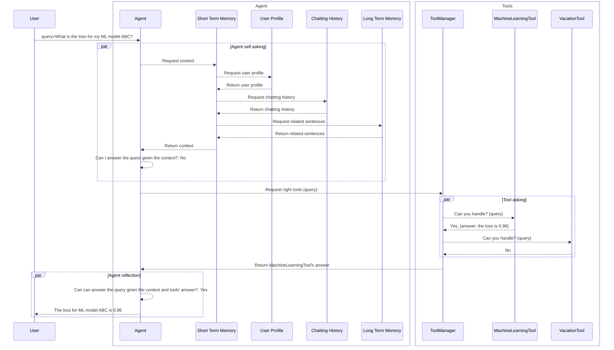

## Modules and Event Sequence:

This design is motivated by the book "Thinking, Fast and Slow", which discusses two systems:
  + System 1 is fast and intuitive, operates automatically and unconsciously, and helps us make quick judgments and react to our environment. 
  + System 2 is slow, conscious, and used for complex tasks like problem-solving or decision-making. It requires effort, enables logical reasoning, and systematic analysis. ==> Tools
* Agent is 

- System1 is Agent which handles
  + Intuitive/easy question 
  + Coordination
  + Communication
  + ...
- System2 consists of Tools which handles complex tasks:
  + Math
  + Information retrieval
  + ...

