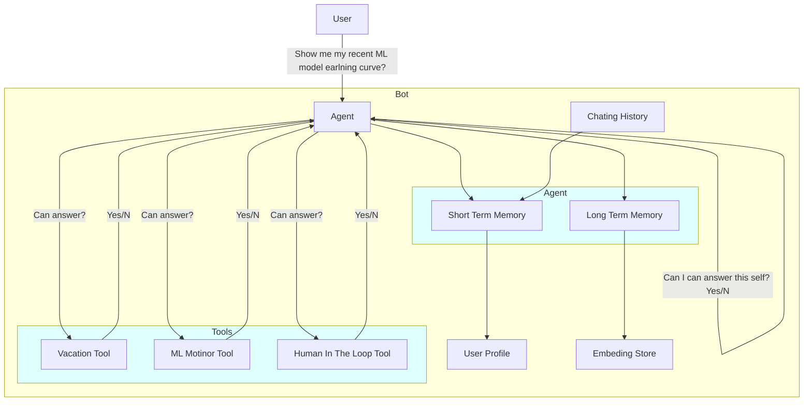

# langchan-play

* [Demo recording](https://www.dropbox.com/s/mdwcg1f8uali5ma/Screen%20Recording%202023-03-30%20at%2011.36.05%20AM.mov?dl=0)
* TODO update design doc

```mermaid
graph TD;
    U[User]
    subgraph Bot
        A[Agent]
        H[Chating History]
        P[User Profile]
        V[Embeding Store]
        subgraph Agent; style Agent fill:#DFFFFF
            S[Short Term Memory]
            L[Long Term Memory]
        end
        subgraph Tools; style Tools fill:#DFFFFF
            T1[Vacation Tool]
            T2[ML Motinor Tool]
            T3[Human In The Loop Tool]
        end
    end

    U --Show me my recent ML model earlning curve?--> A
    A -- Can I can answer this self? Yes/No--> A
    A ---> S
    S ---> P
    H ---> S
    A ---> L
    L ---> V
    A --Can answer?----> T1
    T1 --Yes/No----> A
    A --Can answer?----> T2
    T2 --Yes/No----> A
    A --Can answer?----> T3
    T3 --Yes/No----> A
```
